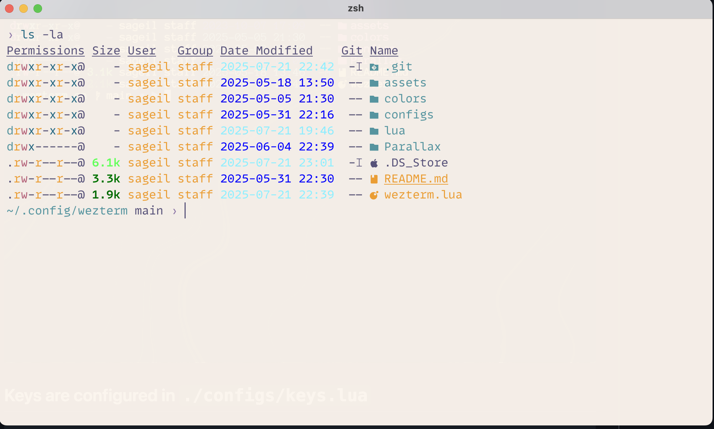
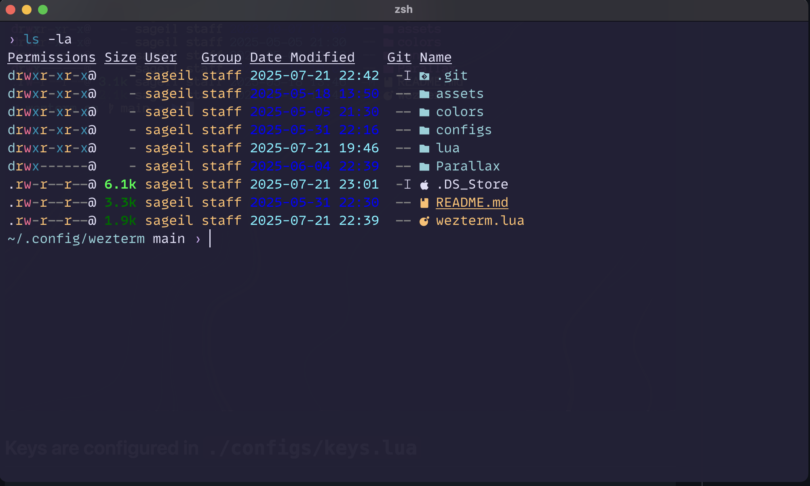

# [Wezterm](https://wezfurlong.org/wezterm/index.html) Configuration

## Using this repo

- backup your existing wezterm configs `mv ~/.config/wezterm ~/.config/wezterm.bak`
- Clone the repo to `~/.config/wezterm`
> [!IMPORTANT]
> None MAC users: Remove the `config.set_environment_variables = {
	PATH = "/opt/homebrew/bin:" .. os.getenv("PATH"),
}` from [wezterm.lua](https://github.com/sageil/wezterm/blob/7864a84ef040591a53c77c2fa5abf045a962d4c8/wezterm.lua#L24C1-L26C2) or change code to reflect your computer `$PATH`.

## Font
 Download and install [Maple Mono NF](https://github.com/subframe7536/maple-font) or [change it to your favourite font](https://github.com/sageil/wezterm/blob/7864a84ef040591a53c77c2fa5abf045a962d4c8/wezterm.lua#L32).

## Screenshots



## Keys

The keys are configured in `./configs/keys.lua`

```lua

local wezterm = require("wezterm")
local act = wezterm.action
local keys = {
	{ key = "-", mods = "CTRL", action = act.DisableDefaultAssignment },
	{ key = "=", mods = "CTRL", action = act.DisableDefaultAssignment },
	{ key = "UpArrow", mods = "SHIFT", action = act.ScrollByLine(-1) },
	{ key = "a", mods = "LEADER|CTRL", action = act({ SendString = "\x01" }) },
	{ key = "-", mods = "LEADER", action = act({ SplitVertical = { domain = "CurrentPaneDomain" } }) },
	{
		key = "\\",
		mods = "LEADER",
		action = act({ SplitHorizontal = { domain = "CurrentPaneDomain" } }),
	},
	{
		key = "u",
		mods = "SHIFT|CTRL",
		action = wezterm.action.DisableDefaultAssignment,
	},
	{
		key = ",",
		mods = "CMD",
		domain = { DomainName = "CurrentPaneDomain" },
		action = act.SpawnCommandInNewTab({
			cwd = wezterm.home_dir,
			args = { "nvim", os.getenv("WEZTERM_CONFIG_DIR") },
			--	args = { "top" },
		}),
	},
	{ key = "z", mods = "LEADER", action = "TogglePaneZoomState" },
	{ key = "c", mods = "LEADER", action = act({ SpawnTab = "CurrentPaneDomain" }) },
	{ key = "h", mods = "LEADER", action = act({ ActivatePaneDirection = "Left" }) },
	{ key = "j", mods = "LEADER", action = act({ ActivatePaneDirection = "Down" }) },
	{ key = "k", mods = "LEADER", action = act({ ActivatePaneDirection = "Up" }) },
	{ key = "l", mods = "LEADER", action = act({ ActivatePaneDirection = "Right" }) },
	{ key = "H", mods = "CTRL|SHIFT", action = act({ AdjustPaneSize = { "Left", 5 } }) },
	{ key = "J", mods = "CTRL|SHIFT", action = act({ AdjustPaneSize = { "Down", 5 } }) },
	{ key = "K", mods = "CTRL|SHIFT", action = act({ AdjustPaneSize = { "Up", 5 } }) },
	{ key = "L", mods = "CTRL|SHIFT", action = act({ AdjustPaneSize = { "Right", 5 } }) },
	{ key = "1", mods = "LEADER", action = act({ ActivateTab = 0 }) },
	{ key = "2", mods = "LEADER", action = act({ ActivateTab = 1 }) },
	{ key = "3", mods = "LEADER", action = act({ ActivateTab = 2 }) },
	{ key = "4", mods = "LEADER", action = act({ ActivateTab = 3 }) },
	{ key = "5", mods = "LEADER", action = act({ ActivateTab = 4 }) },
	{ key = "6", mods = "LEADER", action = act({ ActivateTab = 5 }) },
	{ key = "7", mods = "LEADER", action = act({ ActivateTab = 6 }) },
	{ key = "8", mods = "LEADER", action = act({ ActivateTab = 7 }) },
	{ key = "9", mods = "LEADER", action = act({ ActivateTab = 8 }) },
	{ key = "x", mods = "LEADER|SHIFT", action = act({ CloseCurrentTab = { confirm = false } }) },
	{ key = "x", mods = "LEADER", action = act({ CloseCurrentPane = { confirm = false } }) },
	{ key = "n", mods = "SHIFT|CTRL", action = "ToggleFullScreen" },
	{ key = "r", mods = "LEADER", action = act.ReloadConfiguration },
	{ key = "c", mods = "CTRL|SHIFT", action = act.CopyTo("ClipboardAndPrimarySelection") },
	{ key = "v", mods = "CTRL|SHIFT", action = act.PasteFrom("Clipboard") },
	{
		key = "q",
		mods = "CMD",
		action = wezterm.action.CloseCurrentPane({ confirm = false }),
	},
}
return keys
```
## Features:

1. CMD+, will open wezterm configs using [neovim](https://github.com/sageil/wezterm/blob/7864a84ef040591a53c77c2fa5abf045a962d4c8/configs/keys.lua#L20). To continue to use this functionality, you need to setup `export EDITOR="nvim"` in your `.bashrc` or `.zshrc`
2. Theme will [switch](https://github.com/sageil/wezterm/blob/7864a84ef040591a53c77c2fa5abf045a962d4c8/wezterm.lua#L14) based on the system settings using this function.
